<div align="center">

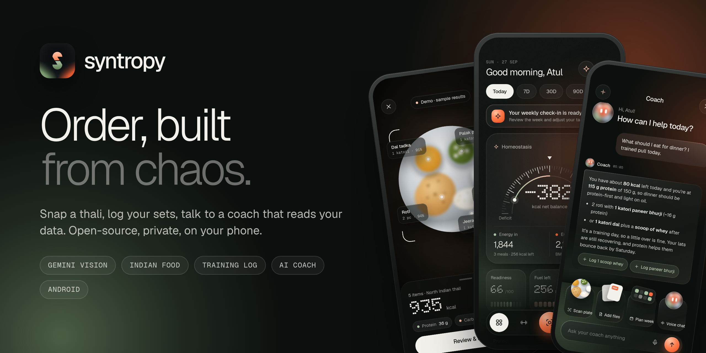

<h1>Syntropy</h1>

<p><strong>Snap a thali. Log your sets. Talk to a coach that actually reads your data.</strong><br/>
An open-source health companion that treats training and Indian-food nutrition as one loop —<br/>
private, local-first, and on your phone.</p>

<p>
  <a href="https://atul-chahar.github.io/syntropy/demo/"></a>
  <a href="https://github.com/Atul-Chahar/syntropy/releases/latest"></a>
  <a href="https://atul-chahar.github.io/syntropy/"></a>
</p>

<p>
  <a href="https://github.com/Atul-Chahar/syntropy/actions/workflows/ci.yml"></a>
  <a href="LICENSE"></a>
  
  
  
  <a href="https://github.com/Atul-Chahar/syntropy/stargazers"></a>
</p>

</div>

---

## Why Syntropy?

Most fitness apps treat your gym log and your food diary as strangers, and most calorie apps were built for sandwiches and salads. Syntropy was built for **how India eats** and for people who **train**:

- 📸 **Photograph your thali** and Gemini names every dish in **roti and katori**, not grams.
- 🍛 **"Ate two more roti later?"** Add them to the same meal in one tap — or just type it.
- 🏋️ **Log every set** with a rest timer, RPE and progression that tells you the weight before you walk to the bar.
- 🧠 **A coach that reads your own logs** — meals, macros, recovery, recent sessions — and never invents numbers.
- 🔒 **No account. No server.** Your data lives on your phone; your Gemini key lives in Android's secure hardware.

> *Syntropy* (/ˈsɪn.trə.pi/) — the tendency of living systems to build order out of chaos. The inverse of entropy.

## Screenshots

<table>
  <tr>
    <td align="center">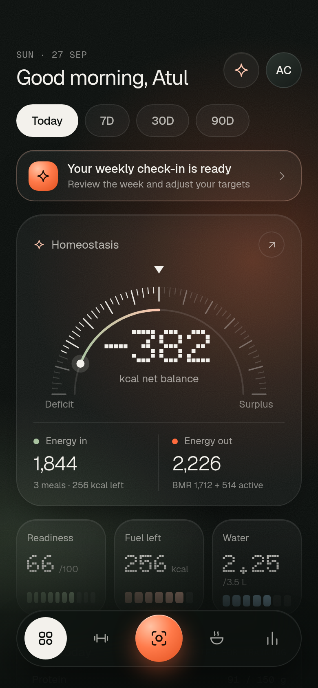<br/><sub><b>Homeostasis</b><br/>energy in vs out</sub></td>
    <td align="center">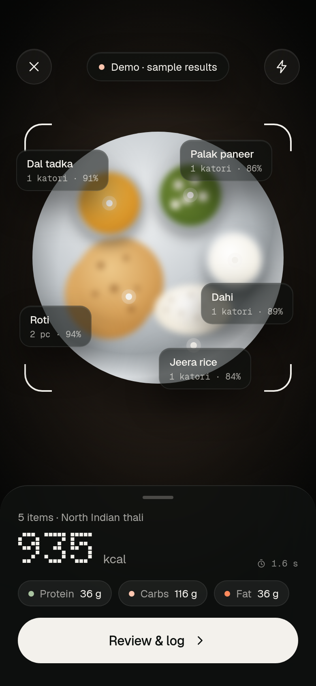<br/><sub><b>Scan a plate</b><br/>Gemini Vision</sub></td>
    <td align="center">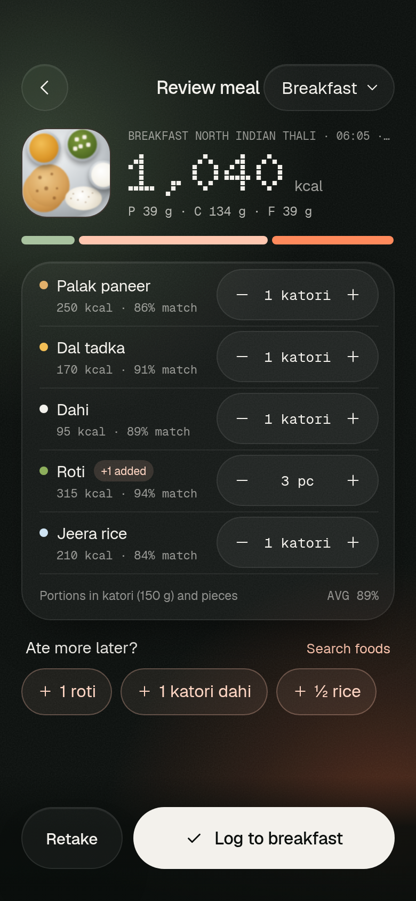<br/><sub><b>Review in katori</b><br/>"+1 added later"</sub></td>
    <td align="center">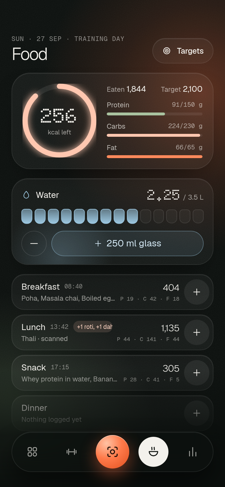<br/><sub><b>Food log</b><br/>macros &amp; water</sub></td>
  </tr>
  <tr>
    <td align="center">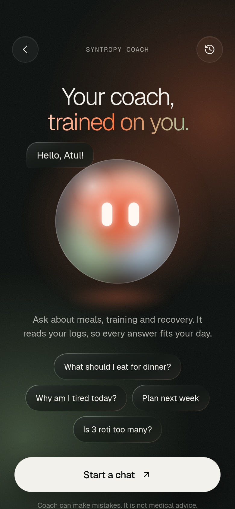<br/><sub><b>AI Coach</b><br/>trained on you</sub></td>
    <td align="center">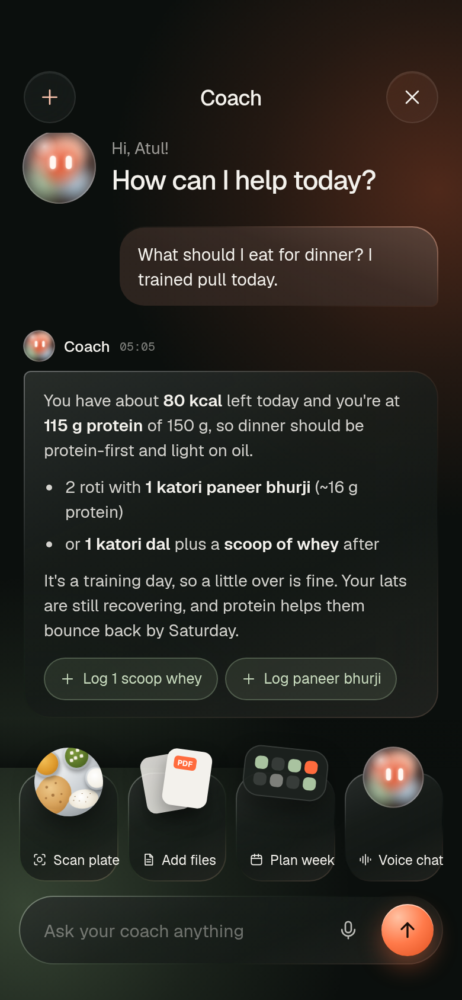<br/><sub><b>Chat</b><br/>one-tap actions</sub></td>
    <td align="center">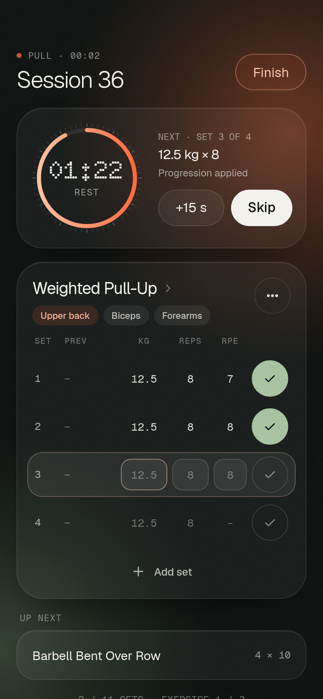<br/><sub><b>Workout</b><br/>rest timer &amp; RPE</sub></td>
    <td align="center">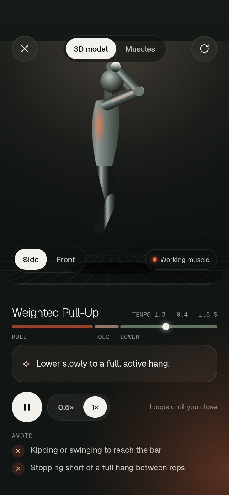<br/><sub><b>Form guide</b><br/>animated tempo</sub></td>
  </tr>
  <tr>
    <td align="center">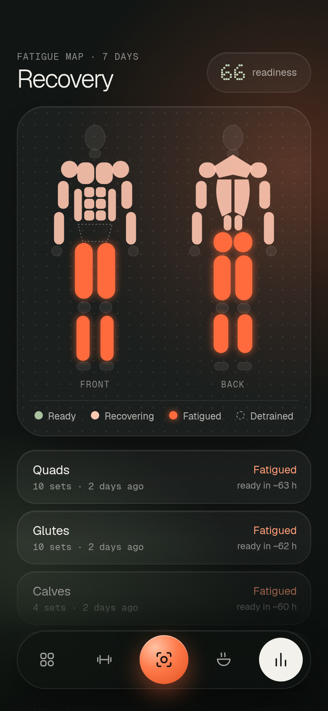<br/><sub><b>Recovery</b><br/>fatigue map</sub></td>
    <td align="center">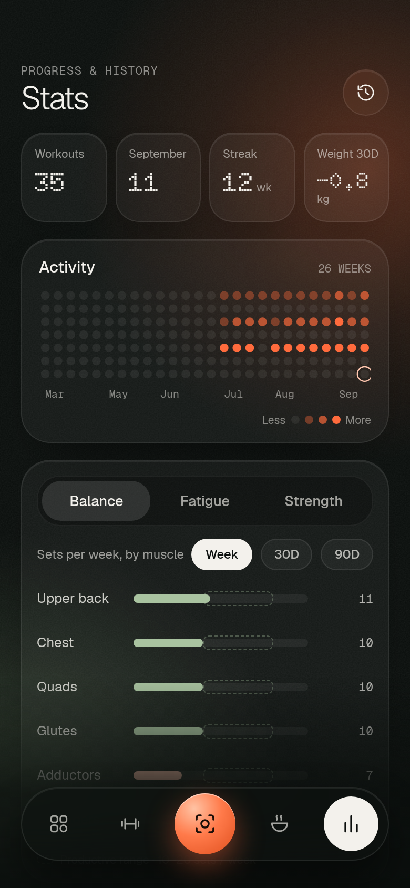<br/><sub><b>Stats</b><br/>balance &amp; e1RM</sub></td>
    <td align="center">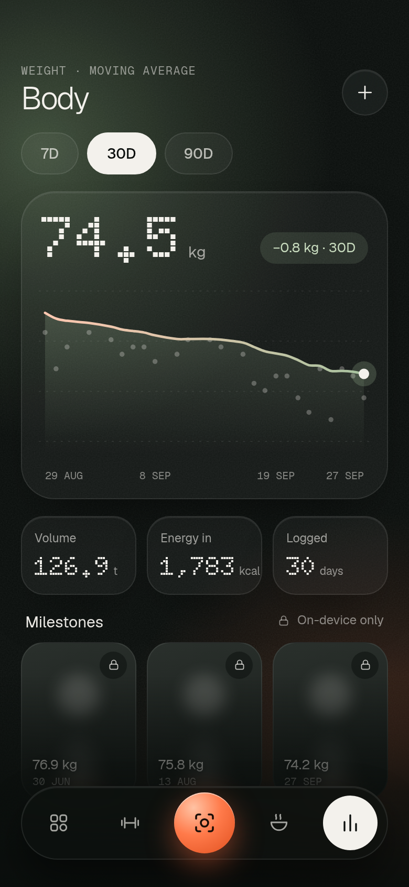<br/><sub><b>Body</b><br/>weight trend (EMA)</sub></td>
    <td align="center">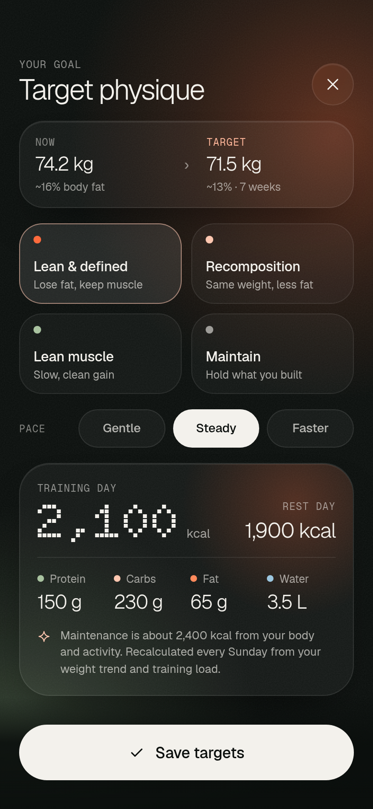<br/><sub><b>Target physique</b><br/>adaptive targets</sub></td>
  </tr>
  <tr>
    <td align="center">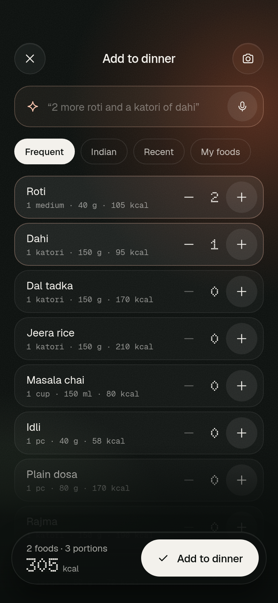<br/><sub><b>Quick add</b><br/>"2 roti and dahi"</sub></td>
    <td align="center">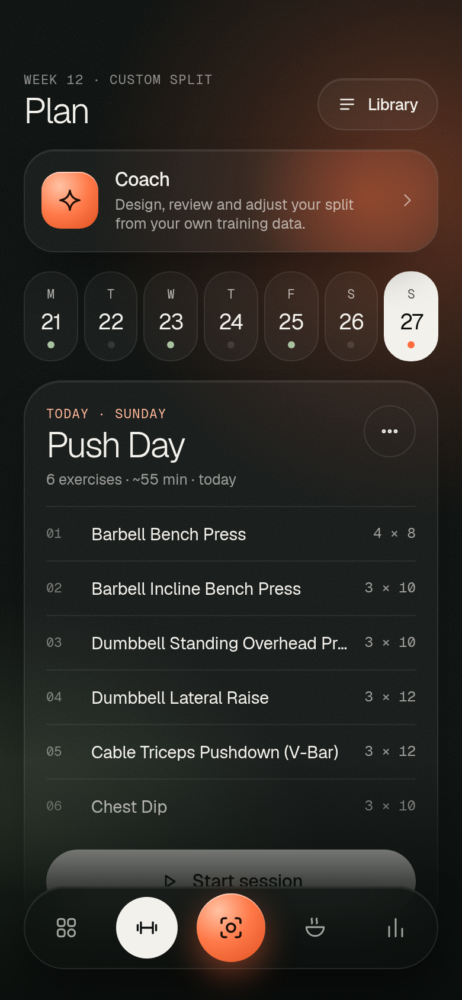<br/><sub><b>Plan</b><br/>your split</sub></td>
    <td align="center">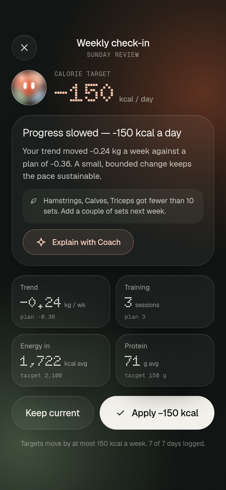<br/><sub><b>Weekly check-in</b><br/>code decides, AI explains</sub></td>
    <td align="center">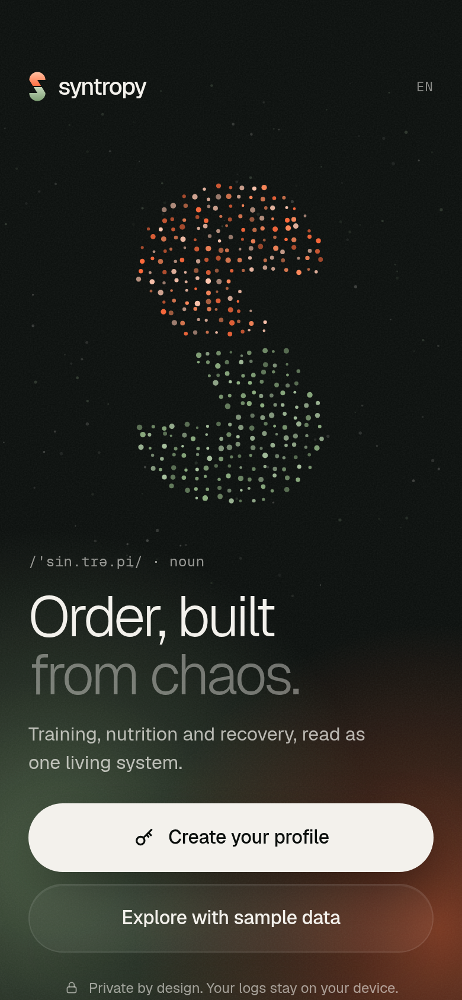<br/><sub><b>Welcome</b><br/>fingerprint lock</sub></td>
  </tr>
</table>

<p align="center">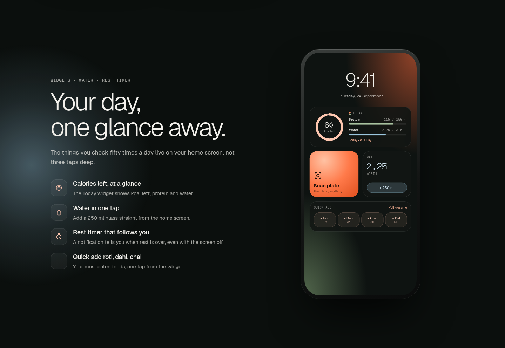</p>

## Features

### 🍛 AI nutrition, built for Indian plates
- **Photo → dishes → macros** with Gemini Vision and a strict JSON schema, validated on the phone.
- Every dish is matched to a **170-food Indian table** (roti, dal, sabzi, dosa, biryani, chai…) so steppers scale in real units: `pc`, `katori (150 g)`, `cup`, `glass`, `plate`.
- **"Ate more later?"** chips and a free-text Quick add (`"2 more roti and a katori of dahi"`) — understood by Gemini, or offline by a local parser.
- Nothing is saved until you confirm. Water tracking, custom foods, day history.

### 🏋️ Training that remembers
- Built on the battle-tested engine of **[OpenGym](https://github.com/DuarteSantos8/openGym)**: 1,324 exercises, progression rules (linear, double, Greyskull), e1RM, supersets, warm-ups, deloads — **763 upstream tests** run in CI.
- Live workout logger with **rest ring + notification**, RPE, previous-session column, and progression notes ("Hold +12.5 kg until every set reaches 8").
- **Fatigue map** (front/back body map), weekly muscle balance, strength trends, 26-week activity grid, routine builder, history.

### ⚖️ Homeostasis
- **Energy in vs out** on one dial: meals vs BMR (Mifflin-St Jeor) + daily activity + training estimate.
- **Target physique** turns your goal and pace into training-day and rest-day calories, protein, carbs, fat and water.
- **Weekly check-in:** code compares your weight trend (exponential moving average) with the plan and moves targets by at most 150 kcal. Gemini only *explains* the change.

### 🧠 AI Coach
- Streaming chat grounded in an allowlisted **summary** of your day — never raw logs, never your email.
- Attach **photos and PDFs** (your trainer's diet plan), get **one-tap actions** ("Log 1 scoop whey") you approve.
- OpenGym's plan-design pipeline is packaged in `@syntropy/ai`; the plan intake and proposal screens are next on the roadmap.

### 📱 Android native
- Capacitor 8 app with **fingerprint app lock**, dark system bars, haptics, camera, notifications.
- **Four home-screen widgets:** Today (kcal/protein/water), Water +250 ml (works without opening the app), Scan plate, Quick add roti/dahi/chai/dal.
- JSON backup & restore. Works offline; AI features need a connection.

## Try it

| | |
| --- | --- |
| 🌐 **Web demo** | [atul-chahar.github.io/syntropy/demo](https://atul-chahar.github.io/syntropy/demo/) — sample data, works without a key |
| 🤖 **Android** | Download the signed APK from [Releases](https://github.com/Atul-Chahar/syntropy/releases/latest) |
| 🔑 **Gemini key** | Free from [Google AI Studio](https://aistudio.google.com/apikey) → paste it in *Settings → AI & Gemini key* |

> On the Gemini free tier Google may use prompts to improve its products. Syntropy only sends what the AI settings screen lists: the meal photo you scan, the sentence you type, and a daily summary for Coach.

## Architecture

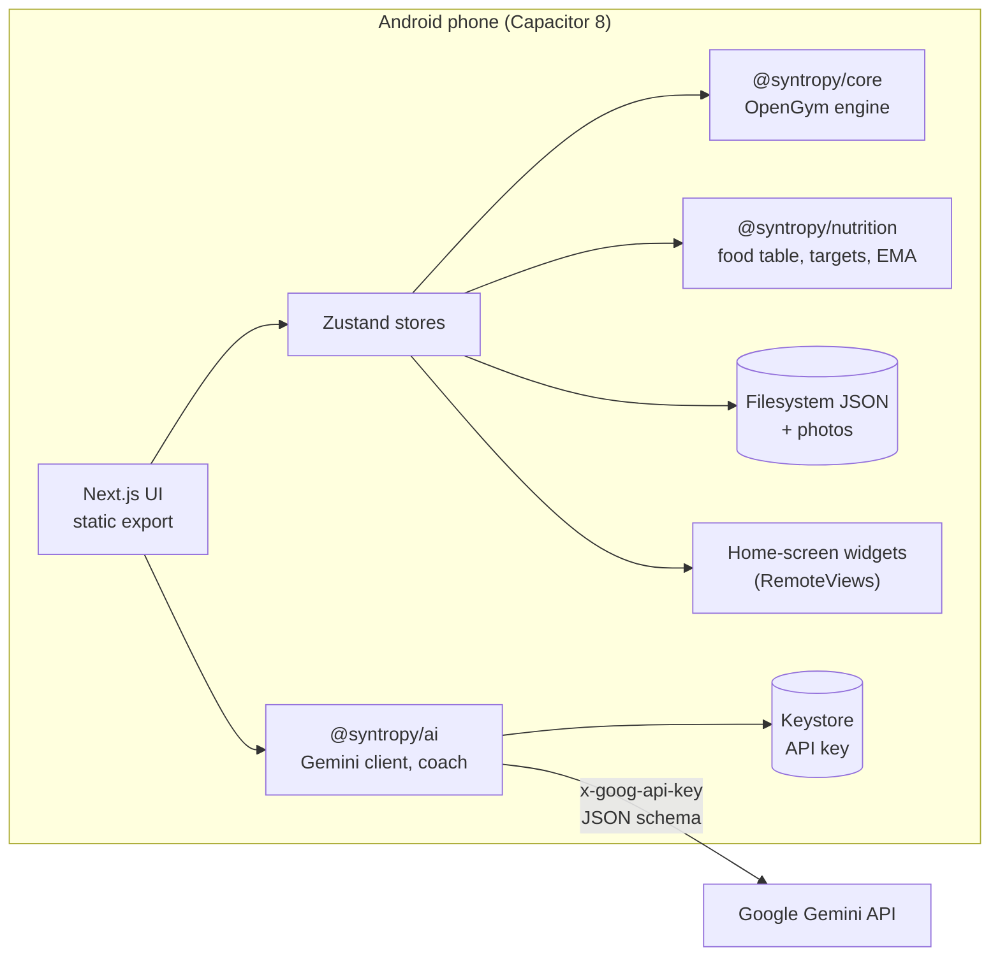

| Package | What it does |
| --- | --- |
| [`apps/app`](apps/app) | The app: Next.js 16 static export inside Capacitor 8, screens, stores, platform adapters, Android project and widgets |
| [`apps/site`](apps/site) | Landing page (static, responsive) |
| [`packages/ui`](packages/ui) | Design system: tokens, glass surfaces, gauge, rings, body map, coach orb, 48 icons, Motion presets |
| [`packages/core`](packages/core) | OpenGym v1.3.8 training engine (imported unmodified, then packaged) |
| [`packages/nutrition`](packages/nutrition) | Indian food table, matching, Mifflin-St Jeor targets, energy balance, weight trend |
| [`packages/ai`](packages/ai) | Gemini REST client (timeout, retry, SSE), meal/text parsing, coach chat, OpenGym coach pipeline |

Deep dive: [docs/ARCHITECTURE.md](docs/ARCHITECTURE.md) · Design: [design/](design) (the original Claude Design boards) · Screens: [docs/SCREENS.md](docs/SCREENS.md)

## Tech stack

**UI** Next.js 16 · React 19 · TypeScript · Motion · CSS Modules · Zustand 5
**Mobile** Capacitor 8 · Android RemoteViews widgets · biometric lock · Keystore secure storage
**AI** Gemini (vision with JSON schema, streaming chat) · on-phone validation and matching
**Quality** Turborepo · pnpm · Biome · Vitest (1,100+ tests) · Playwright E2E · GitHub Actions

## Run it locally

```bash
git clone https://github.com/Atul-Chahar/syntropy && cd syntropy
pnpm install
pnpm dev                    # app on http://localhost:3000 (tap "Explore with sample data")
pnpm dev:site               # landing page on http://localhost:3001
pnpm test                   # unit tests: engine, nutrition, AI
```

<details>
<summary><b>Build the Android app</b></summary>

Requires Java 21 and the Android SDK (pinned in `mise.toml`).

```bash
pnpm --filter @syntropy/app build
cd apps/app && npx cap sync android
cd android && ./gradlew assembleDebug        # app/build/outputs/apk/debug/app-debug.apk
```

For a signed release, create `apps/app/android/keystore.properties` (gitignored) with `storeFile`, `storePassword`, `keyAlias`, `keyPassword`, then `./gradlew assembleRelease`.
</details>

<details>
<summary><b>End-to-end tests and screenshots</b></summary>

```bash
pnpm --filter @syntropy/app build
pnpm --filter @syntropy/app e2e                         # 8 Playwright user flows
NEXT_PUBLIC_SYNTROPY_DEMO=1 pnpm --filter @syntropy/app build
node apps/app/scripts/serve.mjs & node apps/app/scripts/marketing-shots.mjs   # docs/screenshots
```
</details>

## Roadmap

- [x] Design system from the Claude Design boards
- [x] Indian-food photo nutrition, Quick add, water
- [x] Training logger on the OpenGym engine, recovery, stats, body progress
- [x] AI Coach with actions, attachments and the weekly check-in
- [x] Android app, fingerprint lock, widgets, signed APK
- [ ] AI plan design (intake + proposal review on OpenGym's pipeline)
- [ ] Health Connect sync (steps, sleep)
- [ ] 3D form mannequin (react-three-fiber) for more lifts
- [ ] More regional food tables (Bengali, Gujarati, Kerala, Punjabi)
- [ ] Hindi and other Indian languages

Ideas and bug reports are welcome in [Issues](https://github.com/Atul-Chahar/syntropy/issues).

## Contributing

PRs are welcome — especially **food data** (accurate per-unit values for dishes you know well), translations, and accessibility fixes. Read [CONTRIBUTING.md](CONTRIBUTING.md) to get set up in five minutes.

## Credits

- **[OpenGym](https://github.com/DuarteSantos8/openGym)** by Duarte Santos — the training engine, exercise catalogue and coach pipeline this project stands on (AGPL-3.0).
- Exercise metadata from ExerciseDB via [hasaneyldrm/exercises-dataset](https://github.com/hasaneyldrm/exercises-dataset) (MIT); body-map geometry from [MuscleMap](https://github.com/melihcolpan/MuscleMap) (MIT).
- **Animation: [ExerciseDB](https://oss.exercisedb.dev)** — exercise demo GIFs from ExerciseDB's free V1 API (non-commercial use with attribution), streamed at runtime, never bundled.
- Food values compiled from public references (ICMR–NIN IFCT 2017, Indian Nutrient Databank) — estimates, always confirmed by you.
- Design boards made with Claude Design; built with Claude Code.

Full notices: [NOTICE.md](NOTICE.md).

## License

[GNU AGPL v3.0 or later](LICENSE). If you host a modified copy, you must share its source.

<div align="center">

**If Syntropy helps you build a little order, give it a ⭐ — it helps others find it.**

<a href="https://star-history.com/#Atul-Chahar/syntropy&Date"></a>

</div>
