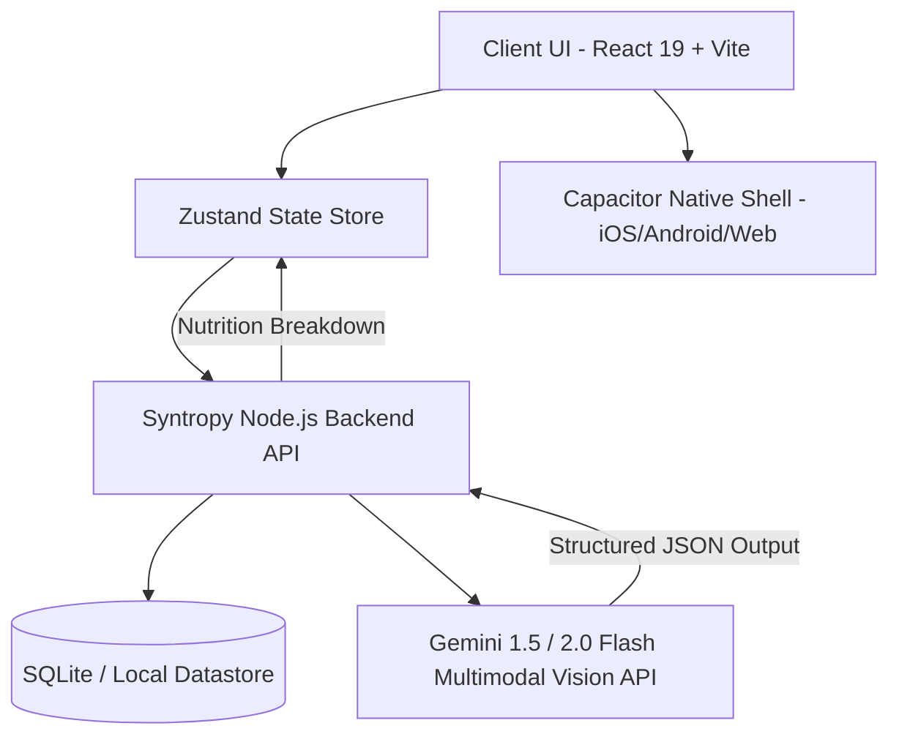
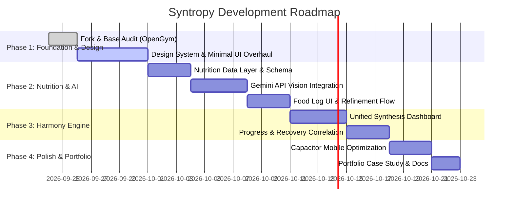

# Project Brief & PRD: Syntropy

> **Syntropy** (`/ˈsɪn.trə.pi/`): *The natural tendency of living systems to build order, symmetry, and sustained vital energy out of chaos. The scientific inverse of entropy.*

---

## 1. Executive Summary & Vision

**Syntropy** is a calm, minimalist, and scientifically grounded health and performance companion that harmonizes physical training and nutritional intelligence in a single, unified interface.

Built upon the open-source foundation of [OpenGym](https://github.com/alexpcosta/opengym), Syntropy elevates the platform with:
1. **A complete UI/UX overhaul:** Replacing utilitarian gym-tracker aesthetics with a disciplined, distraction-free, scientific design language.
2. **AI-Powered Visual Nutrition:** Integrating Google's **Gemini Multimodal API** for instantaneous food recognition, portion approximation, and macro/calorie estimation from a single photo.
3. **Biological Equilibrium (The Synthesis View):** Unifying caloric expenditure, muscular fatigue, and nutrient intake into a singular "energy homeostasis" dashboard.

### Core Objectives
* **Personal Daily Driver:** A practical, private, and frictionless daily companion tailored to personal fitness, body composition goals, and sustainable lifestyle improvement.
* **Portfolio Showcase:** A high-caliber demonstration of product design, component architecture (React 19, Vite, Zustand), mobile-first engineering (Capacitor), and practical AI integration (Gemini Multimodal Vision).

---

## 2. Brand Identity & Design Philosophy

| Pillar | Principle | Implementation |
| :--- | :--- | :--- |
| **Tone** | Calm, Scientific, Non-Judgmental | Neutral observations, biological metrics, zero aggressive red warnings, subtle monochromatic cues. |
| **Aesthetic** | High-End Minimalism | Generous whitespace, disciplined typography (Swiss/grotesque style), subtle border contrasts, dark-mode first. |
| **Philosophy** | Complete Harmony | Training and nutrition are treated as two halves of a single biological loop—not isolated silos. |
| **Language** | Global English | Clear, accessible, precise physiological terminology without unnecessary gym jargon. |

---

## 3. Architecture & Technical Foundation

Syntropy branches from the lightweight, self-hosted architecture of OpenGym:



### Core Tech Stack
* **Frontend:** React 19, Vite, React Router 7, Zustand (state management).
* **Native / Hybrid Wrapper:** Capacitor 7 (iOS, Android, PWA/Web).
* **Backend:** Node.js (ES Modules, native test runner, lightweight HTTP layer).
* **Authentication:** WebAuthn / Passkeys (inherited from OpenGym for frictionless security).
* **AI Intelligence:** Google Gemini API (Multimodal Flash model for low-latency food & calorie inference).
* **Storage & Privacy:** Self-hosted local database; user data and workout logs remain local and private.

---

## 4. Key Functional Modules

### Module 1: Intelligent Routine & Split Training (OpenGym Enhanced)
* **Custom Split Creation:** Support for Push/Pull/Legs, Upper/Lower, Full Body, and custom split rotations.
* **In-Workout Logger:** Frictionless set-by-set input (weight, reps, RPE, rest timers, supersets, warmups).
* **Muscular Fatigue Map:** Real-time visual tracking of active, recovering, fatigued, and detrained muscle groups based on volume and elapsed time.

### Module 2: AI Vision Nutrition & Calorie Intelligence (Gemini Integration)
* **One-Tap Photo Logging:** Capture or upload meal photos directly from the mobile camera or file picker.
* **Multimodal Extraction:** Gemini analyzes the image with strict JSON schema outputs:
  * Dish name and primary ingredients.
  * Estimated portion weight/volume.
  * Macronutrient breakdown (Proteins, Carbohydrates, Fats, Fiber).
  * Total caloric value with confidence rating.
* **Manual Correction & Refinement:** Instant one-click adjustments for user-verified portion sizing.
* **Daily Macro Targets:** Dynamically adjusted targets that account for workout intensity (e.g., carbohydrate refeed recommendations on heavy training days).

### Module 3: The Synthesis Dashboard (Homeostasis Engine)
* **Energy In vs. Energy Out:** Caloric balance visualizer linking Gemini nutritional logs directly against training exertion and basal metabolic estimates.
* **Recovery & Fuel Correlation:** Correlating strength performance trends with nutritional consistency over 7, 30, and 90-day rolling windows.

### Module 4: Body Composition & Progress
* **Progress Tracking:** Weight trend curves (exponential moving averages to filter water fluctuations).
* **Visual Milestones:** Secure, private progress photo gallery with date-matched body weight and volume markers.

---

## 5. Gemini API Vision Integration Specification

### Request Flow
```
User captures meal photo
  → Compressed to WebP/JPEG (client-side)
  → Base64 streamed to Syntropy Backend
  → Gemini API call with structured schema system prompt
  → Returns validated JSON
  → Rendered in UI for confirmation in < 2.0s
```

### Schema Contract (Draft)
```json
{
  "food_items": [
    {
      "name": "Grilled Chicken Breast",
      "estimated_weight_grams": 180,
      "calories": 297,
      "macros": { "protein_g": 56, "carbs_g": 0, "fat_g": 6.5 },
      "confidence": 0.92
    },
    {
      "name": "Steamed White Rice",
      "estimated_weight_grams": 150,
      "calories": 195,
      "macros": { "protein_g": 4, "carbs_g": 43, "fat_g": 0.4 },
      "confidence": 0.88
    }
  ],
  "total_calories": 492,
  "macronutrient_totals": {
    "protein_g": 60,
    "carbs_g": 43,
    "fat_g": 6.9
  },
  "dietary_notes": ["High protein", "Low fat"]
}
```

---

## 6. Implementation Roadmap



---

## 7. Success Criteria & Portfolio Highlights

1. **Design Excellence:** A distinctive, calm visual style that demonstrates clear product taste, spacing discipline, and accessibility.
2. **Speed & Ergonomics:** Zero lag during active workout logging and sub-2-second meal analysis.
3. **AI Pragmatism:** Gemini is implemented with strict JSON schemas, error fallbacks, and user verification, highlighting production-grade AI engineering.
4. **Self-Contained & Elegant:** Clean modular code structure allowing easy local setup or Docker deployment.
